# 🌳 Trees 🌳

When you start learning about them you will see them like this:

```js
class Node {
  constructor(data) {
    this.data = data
    this.left = null
    this.right = null
  }
}

class BinarySearchTree {
  constructor() {
    this.root = null
  }

  insert(data) {
    const newNode = new Node(data)
    if (this.root === null) {
      this.root = newNode
    } else {
      this.insertNode(this.root, newNode)
    }
  }

  insertNode(node, newNode) {
    if (newNode.data < node.data) {
      if (node.left === null) {
        node.left = newNode
      } else {
        this.insertNode(node.left, newNode)
      }
    } else {
      if (node.right === null) {
        node.right = newNode
      } else {
        this.insertNode(node.right, newNode)
      }
    }
  }
}

const tree = new BinarySearchTree()
tree.insert(15)
tree.insert(-1)
tree.insert(-50)
tree.insert(100)

{
  "root": {
    "data": 15,
    "left": {
      "data": -1,
      "left": {
        "data": -50,
        "left": null,
        "right": null
      },
      "right": null
    },
    "right": {
      "data": 100,
      "left": null,
      "right": null
    }
  }
}
```



```mermaid
%%{init: {'theme':'dark'}}%%
stateDiagram-v2
15 --> –1
–1 --> –50
15 --> 100
```

# Different way to define trees

```js
const tree = {
  1: { ids: [2, 3, 4] },
  2: { parentId: 1, ids: [5] },
  3: { parentId: 1 },
  4: { parentId: 1 },
  5: { parentId: 2 },
}


const tree = {
  1: {
    id: 1,
    age: 23,
    name: 'rowad',
    parentId: null,
    childrenIds: [2, 3, 4],
  },
  2: {
    id: 2,
    age: 30,
    parentId: 1,
    name: 'sarah',
    childrenIds: [5],
  },
  3: {
    id: 3,
    age: 20,
    parentId: 1,
    name: 'koa',
    childrenIds: [],
  },
  4: {
    id: 4,
    age: 22,
    parentId: 1,
    name: 'python',
    childrenIds: [],
  },
  5: {
    id: 5,
    age: 6,
    parentId: 2,
    name: 'React',
    childrenIds: [],
  },
}
```


## normalizing the state shape


Converting your data into the above tree shape proves to be very good for performance, here are some examples from readux in react and angular that encourages you to use this shape.

- [normalizing-state-shape](https://redux.js.org/recipes/structuring-reducers/normalizing-state-shape) 
- [entity from @NGRX](https://ngrx.io/guide/entity)
- [createEntityAdapter](https://redux-toolkit.js.org/api/createEntityAdapter)

# 🌳 Trees 🌳 in relational DBs SQL

For `MongoDB` for example you can insert data in the above format and use [$graphLookup (aggregation)](https://docs.mongodb.com/manual/reference/operator/aggregation/graphLookup/) to query it


checkout this SQL `employee` table that represent a 1:m self relationship 

| id |  name | supervisor_id |
|:--:|:-----:|:-------------:|
|  1 | Rowadz |      null     |
|  2 | Sarah |       1       |
|  3 |  Koa  |       1       |
| 4  |  Luke |       2       |
| 5  | Smith |       4       |


- select all Smith's supervisors from 1st to the end

via [postgresql-recursive-query](https://www.postgresqltutorial.com/postgresql-recursive-query/)


